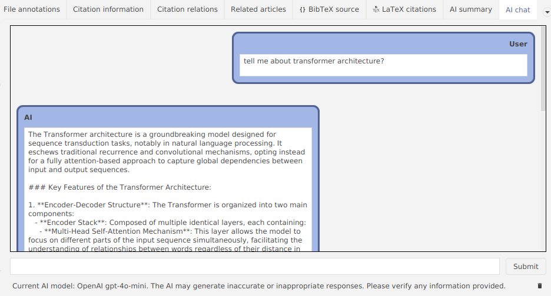
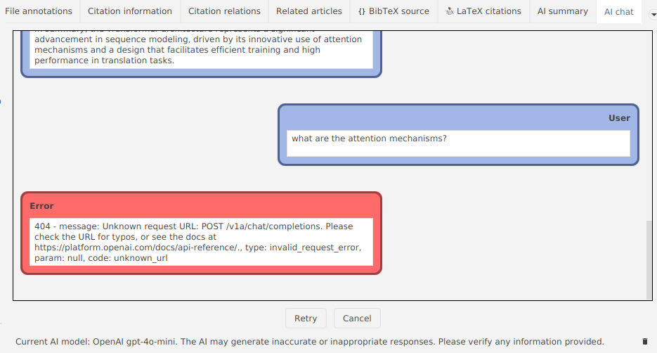
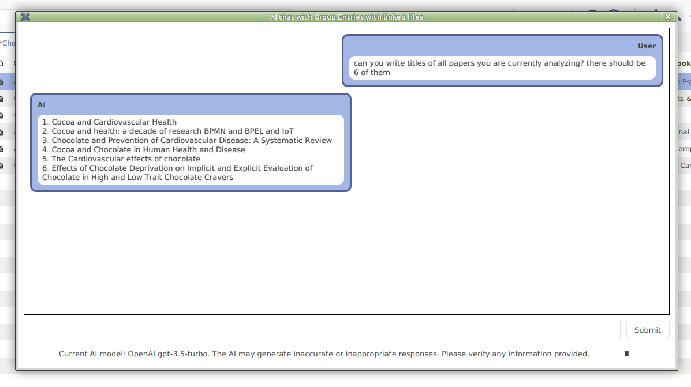
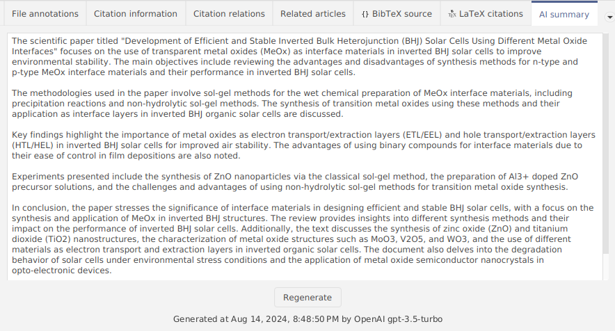
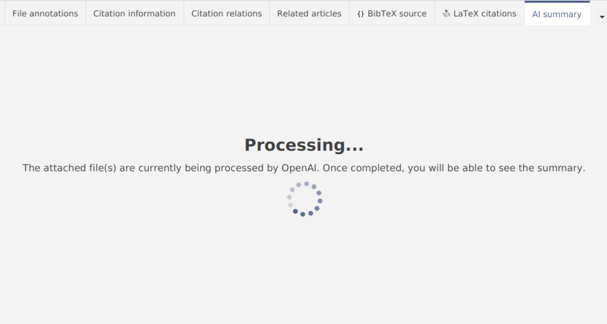
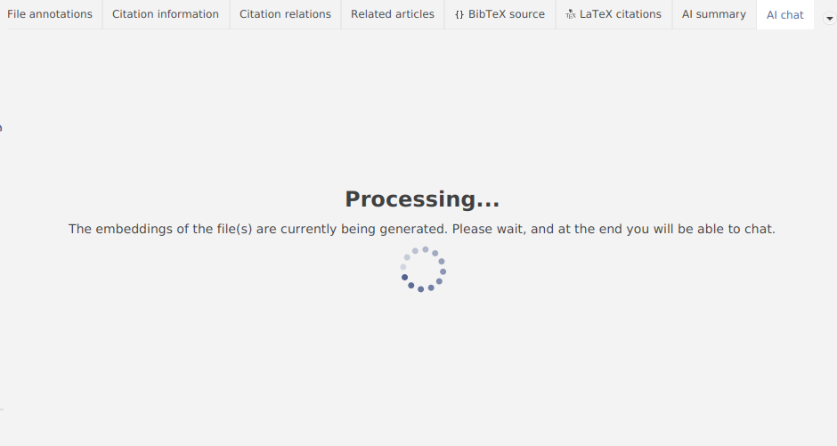
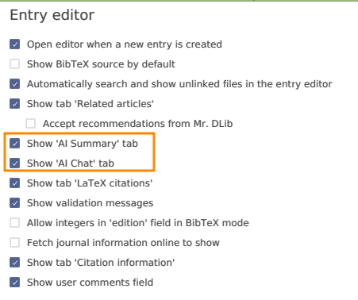
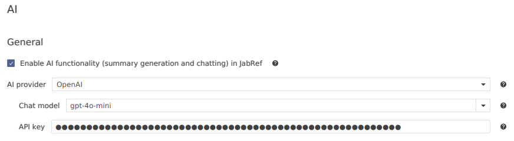
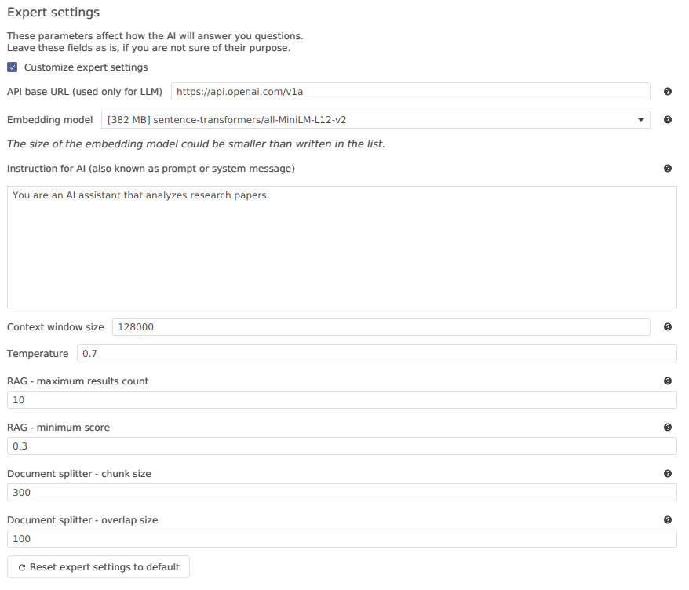

| __Student__            | [Ruslan Popov](https://github.com/InAnYan)                      |
|------------------------|-----------------------------------------------------------------|
| __Organization__       | [JabRef e.V.](https://verein.jabref.org/)                       |
| __Primary repository__ | [JabRef/jabref](https://github.com/jabref/jabref)               |
| __Project name__       | AI-Powered Summarization and “Interaction” with Academic Papers |
| __Project mentors__    | [@koppor](https://github.com/koppor/), [@ThiloteE](https://github.com/ThiloteE), [@Calixtus](https://github.com/calixtus/) |
| __Project page__       | [Google Summer of Code Project Page](https://summerofcode.withgoogle.com/organizations/jabref-ev/projects/details/nFxX1kbl)  |
| __Status__             | Complete                                                        |

# Project

## Description

During my Google Summer of Code (GSoC) project, I was working on enhancing JabRef with AI features to assist researchers in their work. 
Given the current popularity of AI technologies, my mentors and I aimed to integrate LLMs that would analyze research papers, similar to features seen on many other AI platforms.

To achieve this, the project introduced three core AI features:

- **Chatting with Library Entries**. This feature allows users to interact with their library entries through a chat interface. Users can ask questions about specific papers, and the AI will provide relevant answers, making it easier to find information without manually searching through the text.
- **Generating Summaries**. The summarization feature provides a concise overview of research papers. This helps researchers quickly understand the content of a paper before deciding whether to read it in full, saving time and effort.
- **Supporting Multiple AI Providers**. To ensure flexibility and robustness, I integrated support for multiple AI providers. This allows users to choose the AI model that best suits their needs and preferences.

The implementation was primarily done in Java using JavaFX, with the integration of the langchain4j library (a Java counterpart to the Python-based LangChain). 

The AI features developed in this project have the potential to significantly improve the workflow of researchers by providing them with an AI assistant capable of answering questions and generating summaries. This not only saves time but also enhances the overall research process.

## Challenges and important things you learned during the project

There were many challanges during the development of this project, and I developed a lot of skills and knowledge by overcoming them:

- [langchain4j was not easily usable in the JabRef development](https://github.com/langchain4j/langchain4j/issues/1066) due to JabRef making use of JDK's modularization features. However, with the [0.33 release](https://github.com/langchain4j/langchain4j/releases/tag/0.33.0) the problem was solved. Nevertheless, I learned a lot about Java build systems, when we were trying to develop JabRef with older versions of langchain4j.
- At the beginning, it was not possible to debug JabRef on Windows, because the command line generated by gradle grew too large. This issue is related to previous one with split packages. Patching modules introduced a lot of CLI arguments, so Windows could not handle them properly. Moreover, the dependency on langchain4j introduced new modules (which were added to the command line, too). Handling of long command lines with gradle was "fixed" by [gradle-modules-plugin#282](https://github.com/java9-modularity/gradle-modules-plugin/pull/282).
- There were instances where langchain4j was not sufficient for our needs. In such cases, we employed various other libraries (like [`jvm-openai`](https://github.com/StefanBratanov/jvm-openai), [`djl`](https://github.com/deepjavalibrary/djl)) to ensure the functionality and performance of the AI features.
- On the frontend side, there is a long standing issue in JavaFX about [Text of labels should be selectable/copyable](https://bugs.openjdk.org/browse/JDK-8091644). This severely affects how we develop chat UI, because, on one hand, users need a comfortable UI (which can be made with `Label` or `Text` element), but, on the other hand, users will want a copy feature (which is only available in `TextField` or `TextArea` components). [We still have many issues with the chat UI and scrolling down the messsages](https://github.com/InAnYan/jabref/issues/172).

All those issues were unexpected at the beginning of the project, and they caused headaches at my and mentor's side. With having time lost at these unexpected Java eco system issues, we could not work on JabRef itself.

Initially, understanding the existing code base and integrating JavaFX and other libraries was challenging. However, with time and guidance from mentors, I became more proficient. Integrating AI features into the existing application required overcoming numerous bugs and architectural challenges. Most issues were resolved, but there is still work to be done. We faced limitations with available AI libraries for Java, particularly with langchain4j. These issues required additional time and effort to resolve.

Throughout the development process, I gained valuable insights into software engineering. I identified and fixed several small bugs in the original JabRef codebase and discovered many bugs in other libraries. These experiences have significantly enhanced my problem-solving skills and, especially, understanding of AI integration in software applications.

## Work done

**Chatting with AI**:
- Сonnect to LLM.
- Store chat history.
- Delete messages.
- Process errors from AI.

**Generating summary**:
- Generating summary in background: just as embeddings generation, with all information needed.
- Handle both small and large documents.
- Handle models with both small and big context window.
- Show the summary and record the time of the generated summary and model that was used.
- Add the ability to regenerate summary.

**Generating embeddings in background**:
- Tell users that they need to wait before chatting with attached files.
- Generate embeddings in background: it also shows how much work was and should be done, with ETA estimation.

**Privacy notice**:
- Tell users how AI features work.
- Give users link to privacy policies of AI providers.
- Add the ability to agree or disagree (if user don't click "I agree", nothing will happen, they can turn off "AI Chat" and "AI Summary" in preferences).

**AI preferences**:
- Choose chat model.
- Supply an API token.

**Support for multiple AI providers**:
- Choose any provider you like.
- The available model list is updated according to selected AI provider.
- The API token is saved separately for AI providers.
- For Hugging Face there is no supplied list of models (because it's too large), instead users can enter model name manually.

**Expert settings**:
- Users can customize how AI will respond to their requests.

## Future work

Future features include:
- Introduce AI papers search.
- Support fully offline mode (no external access to network).
- Support for external RAG (all of the workload for generating and storing embeddings, generating AI answer is offloaded to a separate server). This can be implemented using [Microsoft Kernel Memory](https://microsoft.github.io/kernel-memory/).
- Integrate [scholar.ai](https://scholarai.io/), or other services.

## Pull requests

## Project-related work

- [AI chatting functionality](https://github.com/JabRef/jabref/pull/11430).
- [Add OpenAI privacy policy](https://github.com/JabRef/jabref/pull/11511).
- [Add more organizations related to AI features to PRIVACY.md](https://github.com/JabRef/jabref/pull/11611).
- [Add explanation of embeddings](https://github.com/JabRef/user-documentation/pull/500).
- [AI functionality in JabRef](https://github.com/JabRef/blog.jabref.org/pull/93).
- [Add AI documentation](https://github.com/JabRef/user-documentation/pull/491).
- [Update AI documentation](https://github.com/JabRef/user-documentation/pull/497).

## Improving JabRef in addition to the project aims

- [Add more explanation for localization in Java code and FXML](https://github.com/JabRef/jabref/pull/11559).
- [Change branches of `scanLabeledControls`](https://github.com/JabRef/jabref/pull/11349).
- [Support .lnk files for TeXworks](https://github.com/JabRef/jabref/pull/11065).
- [Move advanced contribution hints](https://github.com/JabRef/user-documentation/pull/501).
- [Fix help wanted in adding entry PDFs](https://github.com/JabRef/user-documentation/pull/496).
- [Add more explanation for localization in Java code and FXML](https://github.com/JabRef/jabref/pull/11559).

## Pull requests to other repositories

- [Add docusaurus-lunr-search plugin](https://github.com/langchain4j/langchain4j/pull/1221).
- [Implement remove methods for InMemoryEmbeddingStore](https://github.com/langchain4j/langchain4j/pull/1220).
- [Support relative paths without parent directory](https://github.com/langchain4j/langchain4j/pull/817).

## Issues raised

### JabRef

- [Devdocs don't have favicon](https://github.com/JabRef/jabref/issues/11369).
- [Number of indexed files grows after reindexing action](https://github.com/JabRef/jabref/issues/11378).
- ["Default library mode" combobox is cut off](https://github.com/JabRef/jabref/issues/11447).

### Other repositories

JPro-Platform:
- [Logical flaw with stylesheets for Markdown](https://github.com/JPro-one/JPro-Platform/issues/42).

classpath-to-file-gradle-plugin:
- [classpath-to-file-gradle-plugi: Process finished with non-zero exit value 1](https://github.com/redocksoft/classpath-to-file-gradle-plugin/issues/4).

langchain4j:
- [langchain4j:_ \[FEATURE\] Add `logRequests` and `logResponses` to `HuggingFaceChatModel`](https://github.com/langchain4j/langchain4j/issues/1395).
- [\[FEATURE\] Stop document ingestion in the middle of the process](https://github.com/langchain4j/langchain4j/issues/1421).
- [\[FEATURE\] Distribution size of app that uses langchain4j with in-process embedding models](https://github.com/langchain4j/langchain4j/issues/1492).
- [\[FEATURE\] Add context window size and `estimateNumberOfTokens` to `ChatLanguageModel`](https://github.com/langchain4j/langchain4j/issues/1552).
- [\[FEATURE\] Make `DocumentSplitter`s to be `Iterable`s or `Stream`s](https://github.com/langchain4j/langchain4j/issues/1664).
- [\[FEATURE\] Make MessageWindowChatMemory not to remove evicted messages from ChatMemoryStore](https://github.com/langchain4j/langchain4j/issues/1107).
- [\[FEATURE\] Generate new chat IDs automatically as a default parameter](https://github.com/langchain4j/langchain4j/issues/1108).
- [\[FEATURE\] Implement searching on docs website](https://github.com/langchain4j/langchain4j/issues/1219).
- [\[BUG\] FileSystemDocumentLoader cannot handle relative paths without parent directory](https://github.com/langchain4j/langchain4j/issues/816).

JabRef:
- [UI progress indication button is not shown, if at start of JabRef it was hidden](https://github.com/JabRef/jabref/issues/11572).
- [JabRef resets window size and position when a dialog occurs](https://github.com/JabRef/jabref/issues/11668).
- [Black text in Dark mode inside "Citation information"](https://github.com/JabRef/jabref/issues/11512).
- [Extra step in documentation](https://github.com/JabRef/jabref/issues/11284).
- [scanLabeledControl logic issue](https://github.com/JabRef/jabref/issues/11348).

arxiv.py:
- [Use `Optional[T]` for values that may not be present](https://github.com/lukasschwab/arxiv.py/issues/163).

GemsFX:
- [`ExpandingTextArea` doesn't change its height when Enter handler is changed](https://github.com/dlsc-software-consulting-gmbh/GemsFX/issues/198).

h2database:
- [\[QUESTION\] Does `MVStore` supports mutable values in `MVMap`s](https://github.com/h2database/h2database/issues/4090).

djl:
- [\[FEATURE\] Add method to `Criteria` to check whether the model was downloaded or not](https://github.com/deepjavalibrary/djl/issues/3397).

docs:
- [bug: Logical inconsistency about privacy](https://github.com/janhq/docs/issues/54).

# Statistics

TODO

| __Total commits__ |   alot   |
|-------------------|----------|
| __Lines added__   | alot     |
| __Lines removed__ | alittle  |

# Blog posts

- [AI functionality in JabRef](TODO).

# Acknowledgements

I want to say thank you to those people and comapanies:

- [@koppor](https://github.com/koppor/) for mentoring in the project and for raising me as a real developer.
- [@ThiloteE](https://github.com/ThiloteE) for mentoring in the project and for great knowledge of AI ecosystem.
- [@calixtus](https://github.com/calixtus) for mentoring in the project and for reviewing and improving my PR.
- [@langchain4j](https://github.com/langchain4j/) for developing and supporting the [`langchain4j`](https://github.com/langchain4j/langchain4j) library.
- [@hendrikebbers](https://github.com/hendrikebbers) for raising and fixing the [split package problems in `langchain4j`](https://github.com/langchain4j/langchain4j/issues/1066).
- [@StefanBratanov](https://github.com/StefanBratanov) for developing the [`jvm-openai`](https://github.com/StefanBratanov/jvm-openai) library.
- [@deepjavalibrary](https://github.com/deepjavalibrary/) for developing the [`djl`](https://github.com/deepjavalibrary/djl) library.
- [OpenAI](https://openai.com/), [Mistral AI](https://mistral.ai/), and [Hugging Face](https://huggingface.co/) for their API and models.
